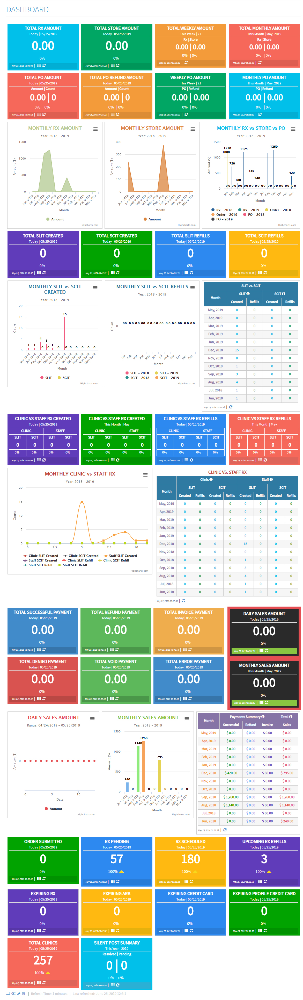

# Dashboard
Display summary of activity of your site into dashboard

This is an exmple code on how to create a dashboard for your Drupal site. 

There are lot of online services, where they offer RestAPI of upload your dashbaord data and widgets to show the dashbaord in your site. But in order to manage those, you need to login to their site. Also where there are lot of data to manage, its become costly, time consuming, un-manageable.

Definitely this code example need some customization to work on. What I want to explain that, you can create create your own dashboard in Drupal, with auto refresh and hook it into cron system. You can also display short reporting on that. Just you need to style the blocks using css and for charts you can use HighChart which is free.

---------------------------------------------------------------
If you need any help, please contact me at: <strong>Shafiq Hossain</strong>, <em>md.shafiq.hossain@gmail.com</em>
